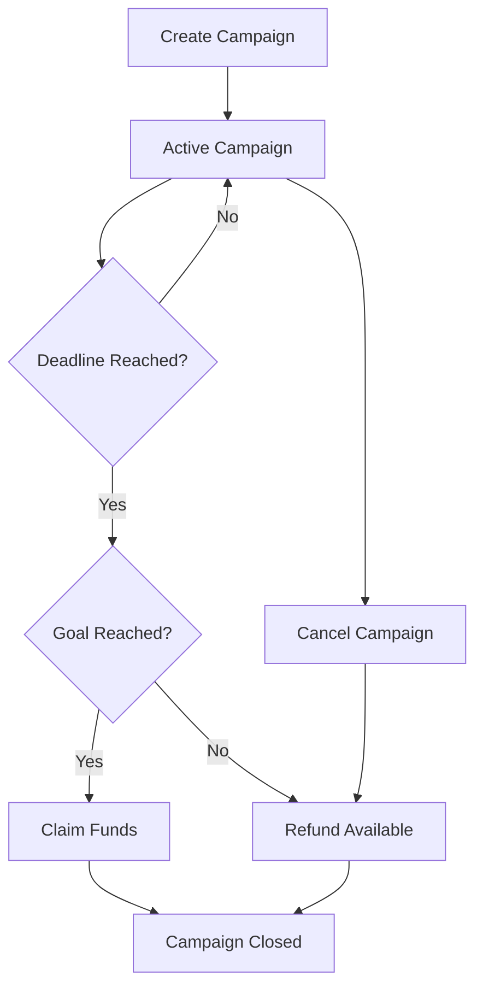

# 🚀 Algorand Crowdfund dApp

> A decentralized crowdfunding platform built on the Algorand blockchain using AlgoPy smart contracts

[](https://algorand.com/)
[](https://algorandfoundation.github.io/puya/)
[](https://lora.algokit.io/testnet/application/748956427)

## � Project Description

**Algorand Crowdfund** is a decentralized crowdfunding application that enables users to create, manage, and participate in funding campaigns on the Algorand blockchain. Built with transparency, security, and efficiency in mind, this dApp leverages Algorand's fast and low-cost transactions to provide a seamless crowdfunding experience.

The smart contract is deployed on Algorand Testnet and can be explored live at: **[App ID: 748956427](https://lora.algokit.io/testnet/application/748956427)**

**Application Details:**
- **Application ID**: `748956427`
- **Application Address**: `IFJKBQ3L6RFVQ6CXUX3KJD6WSVJFEYMLLADRN6X6KLJWEQBVQXTLEY5Q6I`

## 🎯 What It Does

This crowdfunding platform allows:

- **Campaign Creators** to launch fundraising campaigns with specific goals and deadlines
- **Contributors** to support campaigns with ALGO donations
- **Transparent Management** of funds with automated success/failure handling
- **Secure Fund Distribution** based on campaign outcomes

## ✨ Key Features

### 🏗️ Campaign Management
- **Create Campaigns**: Set funding goals and deadlines using unix timestamps
- **Cancel Campaigns**: Creators can cancel active campaigns before deadlines
- **Single Campaign**: Only one campaign active per contract instance

### 💰 Contribution System
- **Secure Donations**: Contributors can safely donate ALGO to active campaigns
- **Amount Validation**: Minimum contribution checks and proper amount handling
- **Deadline Protection**: Contributions only accepted before campaign deadlines

### 🎊 Success Handling
- **Automatic Fund Claims**: Creators can claim funds when goals are reached after deadlines
- **Goal Verification**: Smart contract ensures goals are met before allowing claims
- **Creator Authorization**: Only campaign creators can claim successful funds

### 🔄 Failure & Refund System
- **Automatic Refunds**: Enable refunds when campaigns fail to meet goals
- **Cancellation Refunds**: Refunds available when campaigns are cancelled
- **Fair Distribution**: Transparent refund mechanism for all scenarios

### 📊 State Management
- **Campaign States**: Automatically managed through contract logic (active/inactive)
- **Progress Tracking**: Internal state tracking of raised amounts, goals, and deadlines
- **Transparency**: All campaign data is stored on-chain and publicly verifiable

## 🔧 Smart Contract Functions

| Function | Description | Who Can Call | When Available |
|----------|-------------|--------------|----------------|
| `create_campaign(goal, deadline_timestamp)` | Create new funding campaign | Creator Only | No active campaign |
| `contribute(amount)` | Donate ALGO to active campaign | Anyone | Before deadline |
| `cancel_campaign()` | Cancel active campaign | Creator Only | Before deadline |
| `claim_funds()` | Claim funds from successful campaign | Creator Only | After deadline + goal reached |
| `refund()` | Enable refunds for failed/cancelled campaigns | Anyone | After deadline/cancel + goal not reached |

## 🌐 Live Smart Contract

**Testnet Deployment Details:**
- **Application ID**: `748956427`
- **Application Address**: `IFJKBQ3L6RFVQ6CXUX3KJD6WSVJFEYMLLADRN6X6KLJWEQBVQXTLEY5Q6I`
- **Explorer Link**: [https://lora.algokit.io/testnet/application/748956427](https://lora.algokit.io/testnet/application/748956427)

**Interact with the Contract:**
- **AlgoKit Explorer**: [https://lora.algokit.io/testnet/application/748956427](https://lora.algokit.io/testnet/application/748956427)
- **Algorand Testnet**: Use any Algorand wallet or SDK with App ID `748956427`
- **Direct Integration**: Use Application Address `IFJKBQ3L6RFVQ6CXUX3KJD6WSVJFEYMLLADRN6X6KLJWEQBVQXTLEY5Q6I`

## 💻 Smart Contract Implementation

```python
from algopy import ARC4Contract, UInt64, String, Account, Txn, Global
from algopy.arc4 import abimethod

class Crowdfund(ARC4Contract):
    def __init__(self) -> None:
        self.creator = Account(Global.creator_address.bytes)
        self.goal = UInt64(0)
        self.deadline = UInt64(0)
        self.raised = UInt64(0)
        self.active = UInt64(0)

    @abimethod()
    def create_campaign(self, goal: UInt64, deadline_timestamp: UInt64) -> String:
        # Only creator can create a campaign
        assert Txn.sender == self.creator, "Only creator can create campaign"
        # Prevent overlapping campaigns
        assert self.active == UInt64(0), "Campaign already active"
        # Validate parameters
        assert goal > UInt64(0), "Goal must be greater than 0"
        assert deadline_timestamp > Global.latest_timestamp, "Deadline must be in the future"
        
        self.goal = goal
        self.deadline = deadline_timestamp
        self.raised = UInt64(0)
        self.active = UInt64(1)
        return String("Campaign created!")

    @abimethod()
    def contribute(self, amount: UInt64) -> String:
        # Check if campaign is active
        assert self.active == UInt64(1), "Campaign not active"
        # Check if deadline has not passed
        assert Global.latest_timestamp < self.deadline, "Campaign deadline passed"
        # Check minimum contribution
        assert amount > UInt64(0), "Contribution must be greater than 0"
        # Update raised amount
        self.raised = self.raised + amount
        return String("Contribution accepted!")

    @abimethod()
    def claim_funds(self) -> String:
        # Check if there was ever a campaign (goal > 0)
        assert self.goal > UInt64(0), "No campaign exists"
        # Check deadline has passed
        assert Global.latest_timestamp >= self.deadline, "Campaign still running"
        # Check goal was reached
        assert self.raised >= self.goal, "Goal not reached"
        # Only creator can claim
        assert Txn.sender == self.creator, "Only creator can claim funds"
        # Campaign must not have been cancelled (if cancelled, active would be 0 but deadline not passed)
        if Global.latest_timestamp < self.deadline and self.active == UInt64(0):
            assert False, "Campaign was cancelled, cannot claim"
        
        self.active = UInt64(0)
        return String("Funds claimed by creator!")

    @abimethod()
    def refund(self) -> String:
        # Check if there was ever a campaign (goal > 0)
        assert self.goal > UInt64(0), "No campaign exists"
        # Check deadline has passed OR campaign was cancelled
        assert Global.latest_timestamp >= self.deadline or self.active == UInt64(0), "Campaign still running and not cancelled"
        # Check goal was NOT reached
        assert self.raised < self.goal, "Goal was reached, no refunds"
        
        self.active = UInt64(0)
        return String("Refunds available!")

    @abimethod()
    def cancel_campaign(self) -> String:
        # Check campaign is active
        assert self.active == UInt64(1), "No active campaign"
        # Only creator can cancel
        assert Txn.sender == self.creator, "Only creator can cancel campaign"
        # Campaign can only be cancelled before deadline
        assert Global.latest_timestamp < self.deadline, "Campaign deadline already passed"
        
        # Deactivate campaign
        self.active = UInt64(0)
        return String("Campaign cancelled by creator!")
```

## 🛠️ Technical Implementation

### Smart Contract Architecture
```python
class Crowdfund(ARC4Contract):
    # State Variables
    creator: Account     # Campaign creator address
    goal: UInt64        # Funding goal in microALGO
    deadline: UInt64    # Campaign deadline (unix timestamp)
    raised: UInt64      # Amount raised so far
    active: UInt64      # Campaign status (1=active, 0=inactive)
```

### Key Validations
- ✅ **Creator Authorization**: Only creators can manage their campaigns
- ✅ **Timeline Enforcement**: Strict deadline and timing validations
- ✅ **Goal Verification**: Automatic success/failure determination
- ✅ **Amount Validation**: Proper ALGO amount handling and validation
- ✅ **State Management**: Secure campaign state transitions

### Security Features
- **Reentrancy Protection**: Safe state updates and fund handling
- **Access Control**: Role-based function access (creator vs public)
- **Input Validation**: Comprehensive parameter and state validation
- **Atomic Operations**: All-or-nothing transaction execution

## 🚦 Usage Examples

### Creating a Campaign
```python
# Goal: 5 ALGO (5,000,000 microALGO)
# Deadline: 24 hours from now
goal = 5000000
deadline = current_timestamp + 86400

create_campaign(goal, deadline)
```

### Contributing to a Campaign
```python
# Contribute 1 ALGO (1,000,000 microALGO)
amount = 1000000
contribute(amount)
```

### Campaign Lifecycle
1. **Create** → Campaign becomes active
2. **Contribute** → Users donate during active period
3. **Deadline** → Campaign ends automatically
4. **Claim/Refund** → Funds distributed based on success

## 📈 Campaign States



## 🔍 Testing & Verification

### Test the Smart Contract
1. Visit the [AlgoKit Explorer](https://lora.algokit.io/testnet/application/748956427)
2. Connect your Algorand testnet wallet
3. Try different functions with various parameters
4. Monitor state changes and transaction results

### Example Test Scenarios
- **Create Campaign**: `create_campaign(5000000, 1762070400)` - 5 ALGO goal, 24h deadline ✅
- **Contribute**: `contribute(1000000)` - Donate 1 ALGO to active campaign ✅  
- **Try Early Claim**: `claim_funds()` before deadline ❌ (should fail with "Campaign still running")
- **Cancel Campaign**: `cancel_campaign()` before deadline ✅ (creator only)
- **Claim Success**: `claim_funds()` after deadline + goal reached ✅
- **Refund Failed**: `refund()` after deadline + goal not reached ✅

## 🏗️ Built With

- **[AlgoPy](https://algorandfoundation.github.io/puya/)** - Python framework for Algorand smart contracts
- **[Algorand](https://algorand.com/)** - High-performance blockchain platform
- **[AlgoKit](https://github.com/algorandfoundation/algokit-cli)** - Development toolkit for Algorand

## � License

This project is open source and available under the [MIT License](LICENSE).

## 🤝 Contributing

Contributions are welcome! Please feel free to submit issues, feature requests, or pull requests.

## 📞 Support

- **Smart Contract**: [View on Explorer](https://lora.algokit.io/testnet/application/748956427)
- **Application ID**: `748956427`
- **Application Address**: `IFJKBQ3L6RFVQ6CXUX3KJD6WSVJFEYMLLADRN6X6KLJWEQBVQXTLEY5Q6I`
- **Algorand Developer Portal**: [developer.algorand.org](https://developer.algorand.org)
- **AlgoPy Documentation**: [AlgoPy Docs](https://algorandfoundation.github.io/puya/)

---

**⚡ Start crowdfunding on Algorand today!** 

**Try the smart contract:**
- **App ID**: `748956427`
- **App Address**: `IFJKBQ3L6RFVQ6CXUX3KJD6WSVJFEYMLLADRN6X6KLJWEQBVQXTLEY5Q6I`
- **Explorer**: [https://lora.algokit.io/testnet/application/748956427](https://lora.algokit.io/testnet/application/748956427)

# Original Setup Documentation

### Pre-requisites

- [Python 3.12](https://www.python.org/downloads/) or later
- [Docker](https://www.docker.com/) (only required for LocalNet)

> For interactive tour over the codebase, download [vsls-contrib.codetour](https://marketplace.visualstudio.com/items?itemName=vsls-contrib.codetour) extension for VS Code, then open the [`.codetour.json`](./.tours/getting-started-with-your-algokit-project.tour) file in code tour extension.

### Initial Setup

#### 1. Clone the Repository
Start by cloning this repository to your local machine.

#### 2. Install Pre-requisites
Ensure the following pre-requisites are installed and properly configured:

- **Docker**: Required for running a local Algorand network. [Install Docker](https://www.docker.com/).
- **AlgoKit CLI**: Essential for project setup and operations. Install the latest version from [AlgoKit CLI Installation Guide](https://github.com/algorandfoundation/algokit-cli#install). Verify installation with `algokit --version`, expecting `2.0.0` or later.

#### 3. Bootstrap Your Local Environment
Run the following commands within the project folder:

- **Install Poetry**: Required for Python dependency management. [Installation Guide](https://python-poetry.org/docs/#installation). Verify with `poetry -V` to see version `1.2`+.
- **Setup Project**: Execute `algokit project bootstrap all` to install dependencies and setup a Python virtual environment in `.venv`.
- **Configure environment**: Execute `algokit generate env-file -a target_network localnet` to create a `.env.localnet` file with default configuration for `localnet`.
- **Start LocalNet**: Use `algokit localnet start` to initiate a local Algorand network.

### Development Workflow

#### Terminal
Directly manage and interact with your project using AlgoKit commands:

1. **Build Contracts**: `algokit project run build` compiles all smart contracts. You can also specify a specific contract by passing the name of the contract folder as an extra argument.
For example: `algokit project run build -- hello_world` will only build the `hello_world` contract.
2. **Deploy**: Use `algokit project deploy localnet` to deploy contracts to the local network. You can also specify a specific contract by passing the name of the contract folder as an extra argument.
For example: `algokit project deploy localnet -- hello_world` will only deploy the `hello_world` contract.

#### VS Code 
For a seamless experience with breakpoint debugging and other features:

1. **Open Project**: In VS Code, open the repository root.
2. **Install Extensions**: Follow prompts to install recommended extensions.
3. **Debugging**:
   - Use `F5` to start debugging.
   - **Windows Users**: Select the Python interpreter at `./.venv/Scripts/python.exe` via `Ctrl/Cmd + Shift + P` > `Python: Select Interpreter` before the first run.

#### JetBrains IDEs
While primarily optimized for VS Code, JetBrains IDEs are supported:

1. **Open Project**: In your JetBrains IDE, open the repository root.
2. **Automatic Setup**: The IDE should configure the Python interpreter and virtual environment.
3. **Debugging**: Use `Shift+F10` or `Ctrl+R` to start debugging. Note: Windows users may encounter issues with pre-launch tasks due to a known bug. See [JetBrains forums](https://youtrack.jetbrains.com/issue/IDEA-277486/Shell-script-configuration-cannot-run-as-before-launch-task) for workarounds.

## AlgoKit Workspaces and Project Management
This project supports both standalone and monorepo setups through AlgoKit workspaces. Leverage [`algokit project run`](https://github.com/algorandfoundation/algokit-cli/blob/main/docs/features/project/run.md) commands for efficient monorepo project orchestration and management across multiple projects within a workspace.

## AlgoKit Generators

This template provides a set of [algokit generators](https://github.com/algorandfoundation/algokit-cli/blob/main/docs/features/generate.md) that allow you to further modify the project instantiated from the template to fit your needs, as well as giving you a base to build your own extensions to invoke via the `algokit generate` command.

### Generate Smart Contract 

By default the template creates a single `HelloWorld` contract under crowdfund folder in the `smart_contracts` directory. To add a new contract:

1. From the root of the project (`../`) execute `algokit generate smart-contract`. This will create a new starter smart contract and deployment configuration file under `{your_contract_name}` subfolder in the `smart_contracts` directory.
2. Each contract potentially has different creation parameters and deployment steps. Hence, you need to define your deployment logic in `deploy_config.py`file.
3. `config.py` file will automatically build all contracts in the `smart_contracts` directory. If you want to build specific contracts manually, modify the default code provided by the template in `config.py` file.

> Please note, above is just a suggested convention tailored for the base configuration and structure of this template. The default code supplied by the template in `config.py` and `index.ts` (if using ts clients) files are tailored for the suggested convention. You are free to modify the structure and naming conventions as you see fit.

### Generate '.env' files

By default the template instance does not contain any env files. Using [`algokit project deploy`](https://github.com/algorandfoundation/algokit-cli/blob/main/docs/features/project/deploy.md) against `localnet` | `testnet` | `mainnet` will use default values for `algod` and `indexer` unless overwritten via `.env` or `.env.{target_network}`. 

To generate a new `.env` or `.env.{target_network}` file, run `algokit generate env-file`

### Debugging Smart Contracts

This project is optimized to work with AlgoKit AVM Debugger extension. To activate it:
Refer to the commented header in the `__main__.py` file in the `smart_contracts` folder.

If you have opted in to include VSCode launch configurations in your project, you can also use the `Debug TEAL via AlgoKit AVM Debugger` launch configuration to interactively select an available trace file and launch the debug session for your smart contract.

For information on using and setting up the `AlgoKit AVM Debugger` VSCode extension refer [here](https://github.com/algorandfoundation/algokit-avm-vscode-debugger). To install the extension from the VSCode Marketplace, use the following link: [AlgoKit AVM Debugger extension](https://marketplace.visualstudio.com/items?itemName=algorandfoundation.algokit-avm-vscode-debugger).

# Tools

This project makes use of Algorand Python to build Algorand smart contracts. The following tools are in use:

- [Algorand](https://www.algorand.com/) - Layer 1 Blockchain; [Developer portal](https://dev.algorand.co/), [Why Algorand?](https://dev.algorand.co/getting-started/why-algorand/)
- [AlgoKit](https://github.com/algorandfoundation/algokit-cli) - One-stop shop tool for developers building on the Algorand network; [docs](https://github.com/algorandfoundation/algokit-cli/blob/main/docs/algokit.md), [intro tutorial](https://github.com/algorandfoundation/algokit-cli/blob/main/docs/tutorials/intro.md)
- [Algorand Python](https://github.com/algorandfoundation/puya) - A semantically and syntactically compatible, typed Python language that works with standard Python tooling and allows you to express smart contracts (apps) and smart signatures (logic signatures) for deployment on the Algorand Virtual Machine (AVM); [docs](https://github.com/algorandfoundation/puya), [examples](https://github.com/algorandfoundation/puya/tree/main/examples)
- [AlgoKit Utils](https://github.com/algorandfoundation/algokit-utils-py) - A set of core Algorand utilities that make it easier to build solutions on Algorand.
- [Poetry](https://python-poetry.org/): Python packaging and dependency management.
It has also been configured to have a productive dev experience out of the box in [VS Code](https://code.visualstudio.com/), see the [.vscode](./.vscode) folder.

